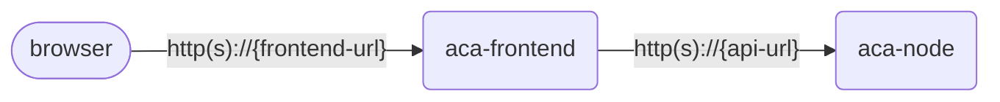

# Azure Container Apps CLI research study

## App overview

You'll be working with the app in this repository. It consists of two projects.

- `aca-node` - A web API that serves data about music albums at `/albums`.
- `aca-frontend` - A Node.js app that serves the web frontend UI for a music store. It calls the web API to retrieve albums data.

There are other projects in the repository that implement the same albums API in other languages.

## Container images

For this study, you won't be working directly with the code; we've created Docker images for both the frontend and web API apps.

These images are in a public repository and do not require authentication.

- `albums.azurecr.io/aca-node:1.0` – the backend web API
    * Listens to port 3000
- `albums.azurecr.io/aca-frontend:1.0` – the frontend app
    * Listens to port 3000
    * The `API_BASE_URL` environment must be set to the base URL of the backend API. Include the scheme (`http://` or `https://`) and do not include a trailing slash. For example, `https://album-api.myhostname.com`).
